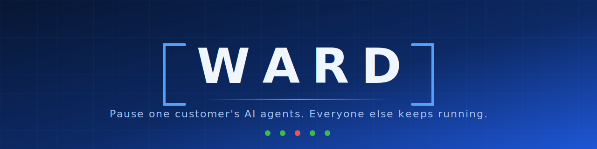

<div align="center">



<br/>

**Pause one customer's AI agents. Everyone else keeps running.**

[-1e56d6)](docs/releases/v0.1.0-rc1.md)
[](docs/USER_INSTALL_NO_NPM.md)
[](openapi/ward.v0.yaml)
[](docs/BUILD_STATUS.md)
[](docs/CLAIMS_AND_EVIDENCE.md)
[](docs/PUBLISH_READINESS.md)

[Quickstart](docs/DESIGN_PARTNER_QUICKSTART.md) ·
[Install (no NPM)](docs/USER_INSTALL_NO_NPM.md) ·
[Integrate](docs/EXISTING_SAAS_INTEGRATION.md) ·
[API Contract](openapi/ward.v0.yaml) ·
[Claims Ledger](docs/CLAIMS_AND_EVIDENCE.md) ·
[Release Notes](docs/releases/v0.1.0-rc1.md)

</div>

---

It is 2 a.m. and one customer's agent is stuck in a retry loop — burning
tokens, hammering rate limits, maybe writing bad data. Your only levers
are a global feature flag or a hotfix, and both punish every other
customer. Ward gives you a third lever: **constrain or pause that one
tenant**, with an approval step and an audit receipt, while the rest of
your customers never notice.

> "Globex was contained. Acme never blipped."

## How it works

Ward is an OpenAI-compatible egress proxy plus a tenant control plane.
Your AI/tool calls carry a tenant ID; Ward attributes, watches, and —
when an operator says so — contains one tenant at the edge.

```text
your SaaS ──(x-ward-tenant-id)──> Ward proxy ──> LLM / tool APIs
                                    │
                     tenant state · pressure detection
                     approval tokens · audit trail
                                    │
                          Control Room (bundled UI)
```

- **Docker-first** self-hosting; **HTTP/OpenAPI** is the integration
  contract (`GET /openapi.yaml` on every running instance).
- **No NPM for users** — one container serves API + Control Room.
- The TypeScript SDK (cooperative `guard()`) is optional, never required.

## Quickstart (no NPM)

```bash
git clone https://github.com/Tenvia/ward && cd ward
docker compose -f docker-compose.user.yml up --build
```

Open **http://localhost:4317** — Control Room, API, contract, SQLite
persistence, demo control token `ward-demo-token`. Verify with Docker +
curl only:

```bash
./scripts/smoke-user-install.sh
```

A prebuilt-image path is prepared (`docker-compose.pull.yml`, target
`ghcr.io/jenksed/ward-api`); no image is published yet, so build
locally for now. Evaluating Ward? Start with the
[design-partner quickstart](docs/DESIGN_PARTNER_QUICKSTART.md).

## Integrate your existing SaaS

You do not have to rebuild your SaaS around Ward. The first integration
is one base-URL change plus a tenant header:

```diff
- OPENAI_BASE_URL=https://api.openai.com/v1
+ OPENAI_BASE_URL=http://your-ward-host:4317/v1
```

```text
x-ward-tenant-id: <your customer id>
```

| Level | Mechanism | Guarantee |
| --- | --- | --- |
| Proxy-only | base URL + header | hard containment for routed calls |
| SDK guard | `ward.guard({ tenantId, run })` | cooperative |
| Workflow runners | Ward launches the work | mock today; Docker dev-only; K8s planned |

Details and honest guarantees: [EXISTING_SAAS_INTEGRATION.md](docs/EXISTING_SAAS_INTEGRATION.md).

## Reliability: Ward should not become the outage

1. **SDK guard fail-open** — if Ward can't answer, `guard()` runs your
   callback and reports `fail_open` (never silently); `failMode:
   "closed"` refuses instead.
2. **Proxy degraded fail-open** — policy-lookup fault with the API up:
   `open` (default) allows with an `x-ward-fail-open: true` header +
   audit event; `closed` blocks 503
   ([overlay](docker-compose.fail-closed.yml)). A successful policy
   read is always enforced.
3. **Proxy hard-down** — planned, customer-side: if the Ward process is
   fully down, proxied traffic does not flow. That needs your fallback
   routing or an HA deployment; neither exists yet, and Ward does not
   claim otherwise.

## What Ward is not

Not an APM tool. Not an agent framework. No Elixir. No Saastle (Ward
runs fully standalone). **Not production-ready** — single-node,
prototype/demo-supported, shared-token control auth prototype, no
license file yet. Read the [claims ledger](docs/CLAIMS_AND_EVIDENCE.md)
before repeating any claim.

## Verification

```bash
./scripts/verify-release.sh    # full battery: 16 sections (maintainers)
npm run validate:openapi       # contract structure
npm run smoke:openapi          # live responses conform to the contract
npm run smoke:demo             # 18-check containment demo
npm run smoke:sdk              # SDK guard + fail modes
npm run smoke:reliability      # fail-open/closed + control auth
./scripts/smoke-user-install.sh          # 16-check no-NPM user path
cd apps/control-room && npm run test:e2e && npm run test:e2e:auth
```

## Repository layout

```text
apps/api/                      Ward API + bundled Control Room (4317)
apps/control-room/             Control Room source (built into the image)
packages/ward-sdk/             Optional TypeScript SDK
examples/node-express-ai-saas/ Existing-SaaS demo app (4401)
examples/docker-agent/         Example agent container
tools/wardctl/                 uv/uvx CLI helper (no NPM)
openapi/                       ward.v0.yaml — the formal contract
scripts/                       Smokes + release verification
docs/                          Runbooks, claims, releases, strategy
```

## Contributors

NPM/Node is contributor tooling only:

```bash
cd apps/api && npm i && npm run dev                      # API :4317
cd examples/node-express-ai-saas && npm i && npm run dev # demo :4401
cd apps/control-room && npm i && npm run dev             # UI  :5173
```

`mise.toml` has optional task shortcuts; mise is never required.

## Documentation

| Doc | What it covers |
| --- | --- |
| [USER_INSTALL_NO_NPM](docs/USER_INSTALL_NO_NPM.md) | The user install path |
| [DESIGN_PARTNER_QUICKSTART](docs/DESIGN_PARTNER_QUICKSTART.md) | Evaluate Ward in 8 steps |
| [DESIGN_PARTNER_EVALUATION_SCRIPT](docs/DESIGN_PARTNER_EVALUATION_SCRIPT.md) | How to demo/discuss Ward |
| [EXISTING_SAAS_INTEGRATION](docs/EXISTING_SAAS_INTEGRATION.md) | Stack-neutral integration |
| [DEPLOYMENT_MODEL](docs/DEPLOYMENT_MODEL.md) | Modes, storage, failure behavior |
| [DOCKER_RUNBOOK](docs/DOCKER_RUNBOOK.md) | Compose stacks + Docker runner |
| [ARCHITECTURE](docs/ARCHITECTURE.md) | Control plane and chokepoints |
| [KUBERNETES_PLAN](docs/KUBERNETES_PLAN.md) | Planned K8s shape |
| [CLAIMS_AND_EVIDENCE](docs/CLAIMS_AND_EVIDENCE.md) | The claims ledger — read this |
| [BUILD_STATUS](docs/BUILD_STATUS.md) | What is verified, with evidence |
| [RELEASE_CANDIDATE_CHECKLIST](docs/RELEASE_CANDIDATE_CHECKLIST.md) | v0.1.0 gates |
| [PUBLISH_READINESS](docs/PUBLISH_READINESS.md) | First-publish procedure (not executed) |
| [STRATEGY_A_C_THEN_B](docs/STRATEGY_A_C_THEN_B.md) | Product strategy |
| [SAASTLE_INTERNAL_APP_DIRECTION](docs/SAASTLE_INTERNAL_APP_DIRECTION.md) | Saastle's internal role |

---

<div align="center">
<sub>Ward is a 10via project. Prototype software — see the
<a href="docs/CLAIMS_AND_EVIDENCE.md">claims ledger</a> before
repeating any claim.</sub>
</div>
